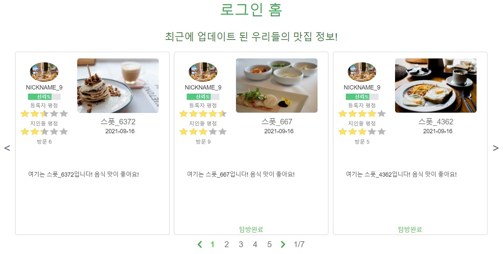
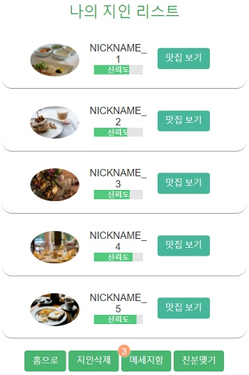

# _OurShef_

## Table of Contents

* [Title](#Title)
* [Short Description](#Short-Description)
* [Icon](#Icon)
* [Purpose](#Purpose)
* [Technology Used](#Technology-Used)
* [Long Description](#Long-Description)
  * Generalization
  * Home
  * Join
  * Login
  * Login home
  * Acquaintance List
    * acquaintance delete
  * Relationship request
  * Message box
    * Accept & Reject
    * Delete message
  * Spot
    * Comment
      * Star point system
      * Reliability system
    * Spot edit
    * Spot delete
  * Spot list of user
  * User info
  * Withdraw
  * Permission check
  * Error page
* [Diagram](#Diagram)
  * Entity Relationship Diagram
* [Client side image processing](#Client-side-image-processing)
* Thanks

## Title

#### OurShef

It is a compound word of ourself and shef, meaning that we find delicious dishes ourselves.

## Icon

A gentle chef who cooks delicious food.

the color `shefGreen`, which is good for the body and fresh, is the identity color

## Short Description

An app that allows you to save restaurants among your acquaintances

You can give a star rating for a restaurant selected by an acquaintance, and calculate the reliability of the acquaintances using the restaurant registrant's star point and the user's star point. 
Create a list of restaurants that fit your taste by forming a community with high reliability!

## Purpose

* to get reliable restaurant information.
* to get recommendations from people who have similar tastes to me.
* to share valuable restaurant information only with me and my community.
* We don't want our valuable restaurant data to be undervalued by others with different tastes.

## Technology Used

* Java
  * Spring Boot
  * Spring MVC
  * JPA
* JavaScript
  * heic2any open source
* HTML
* CSS
* MYSQL
* AWS Cloud Server

## Long Description

* Generalization

  Have you ever wasted valuable money and time by being deceived by restaurant advertisements or false information? Do not worry. With _OurShef_, you don't have to! Get restaurant recommendations from trusted acquaintances.

  Whenever your acquaintances update restaurants, you can check the list in real time. You can also recommend restaurants to your acquaintances. When registering a restaurant, you can give a star rating by it's grade.

  Also, you can give a star rating for a restaurant selected by an acquaintance, and calculate the reliability of the acquaintances using the restaurant registrant's star point and the user's star point.
   Create a list of restaurants that fit your taste by forming a community with high reliability!

  
---
 
* Home

 

  

  This is the first page you see when you enter the domain root without logging in. OurShef, a healthy shefGreen color, will greet you with a friendly smile.
If you do not have an ID, press the upper button to enter the Join page.

  
---

 
* Join

 

  
  

  

 
  This is the page for registering as a member. A main profile image is required. The password must not include a nickname, and 8 to 16 characters are allowed.

  If you use a duplicate ID or violate the above rules, an error message asking you to enter the value again appears.

    

If your account creation is successful, you will be notified that your account has been created and ourShef will welcome you.

  
---
 

* Login

 

  
  

 

This is a beautiful login screen. A pretty green light appears when you hover the cursor over it. Anyway, if you enter the wrong ID and password, an error message appears asking you to re-enter it.

  
---

 
* Login home
 

  

      
      
  

 
  This is the most beautiful page. Recently updated information of acquaintances is uploaded to the top. If the number of restaurants of your acquaintances increases, you can use the bottom paging function to turn to the next page. Five places appear per page, and in case of a mouse or smartphone, you can swipe through the list by sliding.

  At the bottom, the login user's most recent update location is displayed.

  For each spot information, the profile image,  the nickname, the reliability, the star point of the registrant, the star point of the users, the name of the restaurant, the description of the restaurant, the number of visitors, and the registration date are displayed.

  If you click the image of a restaurant, you will be taken to the Spot page, and if you click the user profile image, you will be taken to the user's Spot list page.

  If you go to the Spot page, comment and give stars, the next time you come to login home, a green hip message stating that your visit is complete will appear below the information about the spot.

  Below that are several buttons. These are the spot registration button, my spot list button, acquaintance list button, my information button, and logout button, respectively.
  

	    

        

If you are new, this screen will welcome you. The list of acquaintance spots will briefly inform you that you can add acquaintances and rate their spot. It also explains the rating and reliability systems. The more similar the user's rating and the registrant's rating, the higher the reliability. _This is ourShef's most important system, allowing us to create a trusted and similar taste community!_

At the bottom of the login user's recent spot information, a friendly guide to register a spot appears.

  
---

 

* Acquaintance List

 
  

      
  

 

  If you click on the list of acquaintances at the bottom of the login home page, it moves to the list of acquaintances. On the acquaintance list page, the acquaintances with whom I have a relationship appear. You can see the nickname and reliabilty of your acquaintances.

  At the bottom, there are a go to home button, a delete acquaintance button, a message box button, and a make an acquaintance button.

   

  * acquaintance delete
 
    

        
        
           
        
    

 
    If you click the Delete acquaintance button, a check box is created next to the acquaintance list. If you check the checkbox next to the acquaintance you want to delete and click the Delete acquaintance button again, a pop-up window will appear asking if you really want to delete it. Click the OK button to delete the acquaintance.  The important thing here is that if you want to delete an acquaintance, you can delete it regardless of the acquaintance's will. And at the moment of deletion, all comments related to the acquaintance are deleted from the list of restaurants I uploaded, and the star point is reset.   All comments I made on the acquaintance's restaurant will also be deleted and the  star point will be reset. The reliability of me and my acquaintances is also reset.
  OurShef's relationship management is very fast and neat. If there is no acquaintance relationship, old data is not left in each other's communities, so pure community evaluation and reliability management are possible.

  
---

 

* Relationship request

 
  

      
      
      
  

 
  if you click the make an acquaintance button, You will be taken to the relationshiptRequest page.

  You can request a relationship by entering an acquaintance's ID. If you enter an ID that does not exist, or if you enter the ID of an acquaintance who is already an acquaintance, an error is displayed.

  

      
  

  If the acquaintance request is successful, it is moved to the relationship request box, and you can check the acquaintance request message sent. If your acquaintance has not checked the message, you can check the status before checking.
 
  

* Message box
 
  

      
  

   

  If you have received an acquaintance request, an orange-colored number alarm will appear on the message button as many as the number of acquaintance request messages.

  If you press the message box button on the acquaintance list page, it moves to the message box page. The message box page consists of a relationship request box page and a relationship response box page.

  
 
  

      
      
  

 
  

  The first screen that appears is the relationshipt Response box, where you can see the messages received. You can move the request box and response box by using the toggle button in the middle at the bottom, and you can check the status of the relationship request message I sent in the relationshipt Request box.

  If the acquaintance has not confirmed it, the status before confirmation is displayed, if it has been accepted, the status is accepted, and if it has been rejected, the status is rejected.

  At the bottom, there are a button to go to the acquaintance list page, a toggle button to move to the response box and request box, and a button to delete a message.

  

 
  * Accept & Reject
 
    

        
    

 
    you can reject and accept the message in the relationship response box. If accepted, the user is added to the acquaintance list and the status of the message changes to Accepted. If it is rejected, it changes to a rejected state, and the user can check whether his or her request message has been accepted, rejected, or before confirmation, just like you.  And the message before confirmation is displayed at the top.

     

  * Delete message
 
    

        
        
          
        
    

 
You can also delete acquaintance requests and response messages. There is a delete button in the lower right corner of the message box. When you click the button, a check box appears. If you check next to the message you want to delete and click the Delete button again, a pop-up appears asking that you really want to delete it. Click the OK button to delete the message.

Messages always exist in pairs. When I send a request message, a response message is sent to an acquaintance. When an acquaintance sends a request message, I receive a response message. So even if the message in my message box is deleted, the messages in the acquaintance's message box remain. However, if I delete the message in the response box in the state before confirmation, the acquaintance will confirm that the message has been rejected.

If you leave ourShef, all messages related to you will disappear even in your acquaintance's message box.

  
---

 
* Spot

 
  

      
  
    
  

      
  
   
  

      
  
   
  

      
  
   
   

  You can get detailed information about the Spot by going to the Spot page. And you can see the main photo for the spot in a larger size, and if the registrant has registered an additional photo, you can see the added photo.

  The spot name, main photo, registration date, registrant star point, visitor (users) star point, number of visits, spot description, additional photos, comment list, and registrant information appear sequentially.

  At the end, there is a button to go to the login home, and a button to edit a spot. If it's not a logged-in user's spot, the edit button won't show up.

   

  * Comment
  

    

        
        
    
 

    If you click the comment button, a form to put a comment appears. Enter the desired word, give a star point, and press the enter button to leave a comment.   If you leave a comment, you will be recognized as a visitor and the number of visitors will increase by one. If you look at this place on the login home page, you'll see a green text that says Visit Complete.
 
    

        
    
 
    

        
        
    
 
    

        
    
 
 
    Clicking on a comment enters the comment detail view mode. If the comment is long, only the front part is shown. If you click the comment, you can check the registration time along with all the content.  If the commenter is a logged-in user, an edit button and a delete button will appear. You can edit the content and star point by clicking the edit button. You can also delete comments by clicking the delete button. Whatever you do, the user star points of the place and the reliability of the registrants will be updated.  
    
 Star point system 
    
  When comments are added or modified or deleted from the spot, the user's star point of the corresponding spot is updated.

 Reliability system 
    
  When comments are added or modified or deleted from the spot, the reliability of the registrant is also updated.
       	
  

  * Spot edit

    

        
    
 
    

        
    
 
 
	
  You can edit your registered spot information by entering the spot edit page. The star point saved during registration can also be edited. When the star point is modified, not only the registrant's star point is modified, but also the reliability of the registrant is updated.
 
  

  * Spot delete
  

    

        
    
 

  You can also delete the spot. If you click the delete button, a pop up will appear asking if you really want to delete it. If you press the ok button, all the spot information and comments of your acquaintances are deleted. Of course, the reliability of the registrant is also updated.

  
---

 

* Spot list of user
 
  

      
  
 
  

      
  
 
  

      
  
 

If you click your profile image in login home or click the My Restaurants button, you can see the My Restaurant list page. If you click on an acquaintance's profile image, you will be taken to the acquaintance's restaurant list page. You can also view your acquaintance's restaurant list page by clicking the acquaintance restaurant list button next to the acquaintance information on the acquaintance list page.

In order from the top, there are the registrant information, the restaurant list, the pager, and the home button.

If you register a spot that doesn't fit the community or your reliability goes down, you can find the cause here.

  
---

 

* User info
 
  

      
      
      
  

 
  

      
  

 

If you click the My Information button in login home, you can enter the My Information page. You can edit my information here. All information except ID can be edited. If you want to change your password, click the Change Password button. Then a new password and a new confirmation password box will appear. Enter your desired password there and click the Apply button at the bottom right.

One thing to keep in mind is that you must enter your original password to change your personal information.

If you enter incorrect information, an error will appear and you will be asked to re-enter it.

  
---

 
* Withdraw 
  
 
  

      
  

  

      
  

  

      
  

 
If you click the withdraw button on user info page, a popup will appear asking if you really want to withdraw. If you click the ok button, It will be prompted to enter your password once again. Finally, once you have successfully entered your password, you will be taken to a screen informing you that your account has been deleted.

Upon withdrawal, all your data (spots, comments, messages, img files, etc) will be deleted.

  
---

 

* Permission check
 

  

      
  

 
I don't want this to happen, but if you try to view the spot information of a non-acquaintance user or access the user information of another user or delete edit everything not your thing, you will come across this scary page. Please don't do that.

  
---

 

* Error page

 
  

      
  

 
If there is an error in the server, you will see this screen. If you see this screen by all means, please forgive the cute chef with his eyes spinning. There are several separate error pages for each error, but it's not important.

  

## Diagram

### 	Entity Relationship diagram

    

## Client Side Image Processing
 

    

 
* Apple's _HEIC_ format support

* Reduce large size images

Supports apple's heic image format. If the user attaches an image file in heic format to the form, the loading screen fade in and img processing start.

First, check if it is in heic format. If it is in heic format, it is converted to jpg. The image file converted to jpg is reduced to the size set according to the purpose of the image. If you attach a png format file, it will be reduced to a png and uploaded. When the file is reduced, the orientation information of img is referenced.

All this process takes place on the client, so the load on the server can be reduced.

 

## Thanks

Thanks to everyone who read the long post :)
